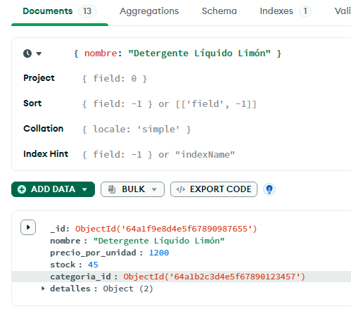
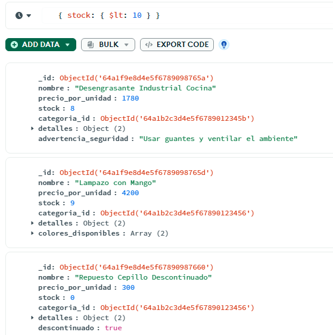
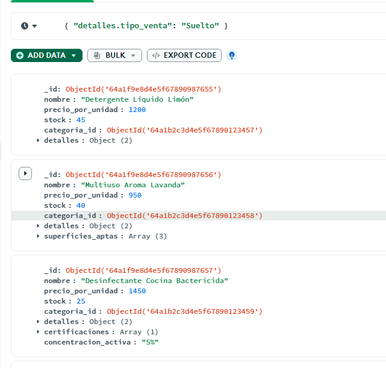
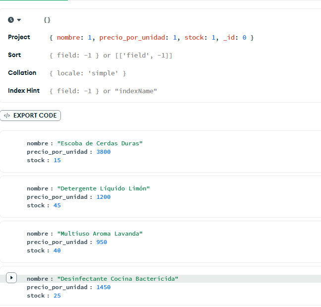
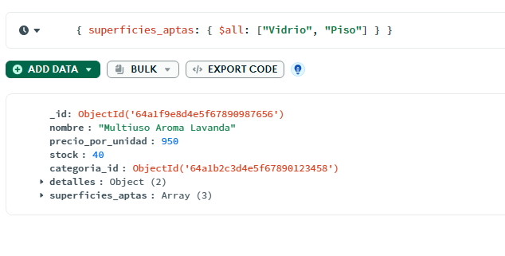
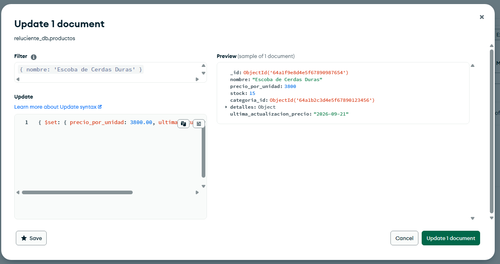
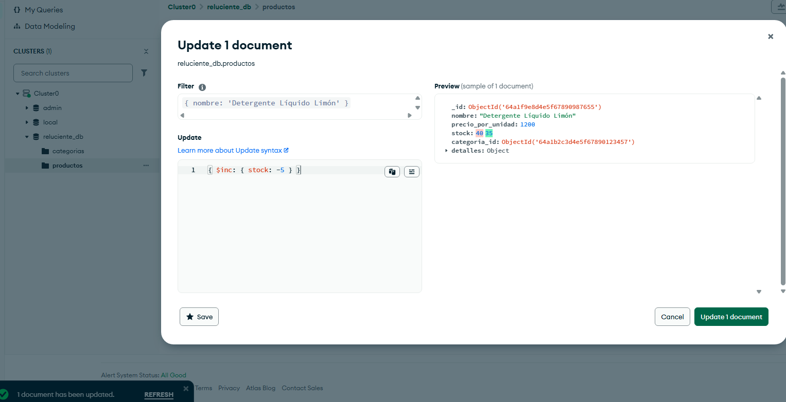
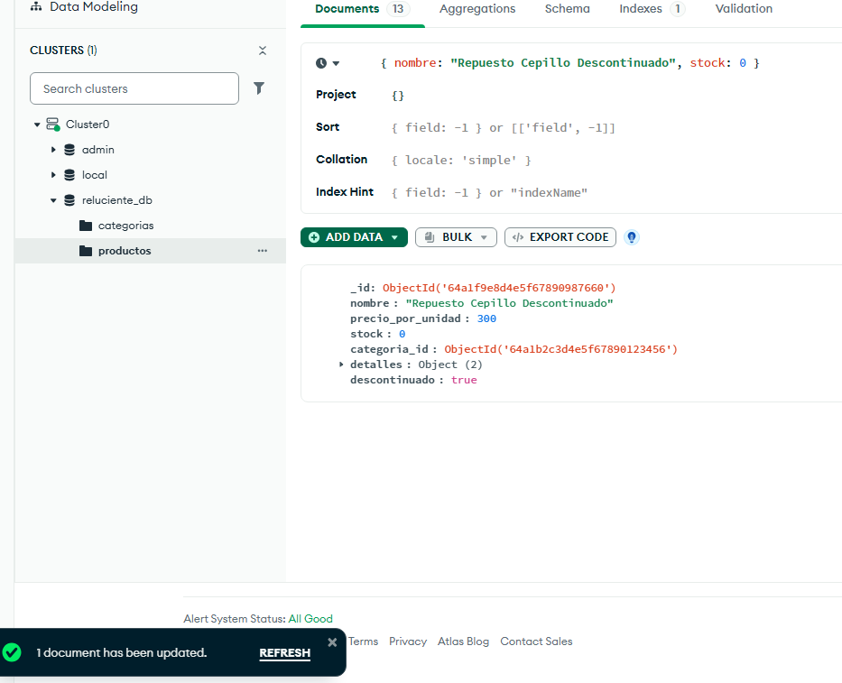

Sistema de Gestión "Reluciente" \- Artículos de Limpieza

**1\. Definición del Dominio del Problema** El sistema busca automatizar y organizar la administración de un comercio minorista enfocado en la venta de artículos de limpieza. El problema principal a resolver es la necesidad de gestionar un catálogo de productos dinámico y controlar el stock disponible de forma ágil para optimizar la atención al cliente en el mostrador.

Para organizar el inventario, el sistema clasificará los productos en las siguientes familias principales:

🟡​**Multiusos: Aptos para diversas superficies como encimeras, mesas y pisos, ideales para limpieza diaria.**

🟡​**Desinfectantes: Diseñados para eliminar bacterias y virus, recomendados en cocinas, baños y áreas que requieren higiene estricta.**

🟡​**Limpiadores específicos: Formulados para superficies concretas como vidrio, madera, alfombras o textiles.**

🟡​**Detergentes: Para ropa y tejidos, en forma líquida o en polvo, eliminando manchas y olores.**

🟡​**Desengrasantes: Eficaces contra grasa y aceite, especialmente en cocinas e industrias.**

🟡​**Limpiadores enzimáticos: Utilizan enzimas activas para descomponer manchas orgánicas complejas y neutralizar olores.**

🟡​**Utensilios y Accesorios: Artículos físicos complementarios para la aplicación de productos y remoción de suciedad, tales como lampazos, estropajos, esponjas y escobas.**

Rol de la base de datos: La base de datos NoSQL jugará un rol central al proveer una estructura flexible que permita almacenar productos con distintas características (volúmenes, tipos de presentación, etc.) sin las restricciones de un esquema rígido. Esto garantizará lecturas rápidas y eficientes del catálogo general al momento de registrar ventas o consultar disponibilidad.

**2\. Esquema de las colecciones** Para priorizar la forma en que la aplicación consumirá los datos, se diseñaron dos colecciones principales: categorías y productos.

* Colección: categorías (Estructura Referenciada) Almacena las familias principales detalladas en la definición del dominio.

Categoría: Utensilios y Accesorios

{

&nbsp;&nbsp;&nbsp;&nbsp;"\_id": { "$oid": "64a1b2c3d4e5f67890123456" },

&nbsp;&nbsp;&nbsp;&nbsp;"nombre": "Utensilios y Accesorios",

&nbsp;&nbsp;&nbsp;&nbsp;"descripcion": "Artículos físicos complementarios comercializados por unidad"

&nbsp;&nbsp;}

Categoría: Detergentes

{

&nbsp;&nbsp;&nbsp;&nbsp;"\_id": { "$oid": "64a1b2c3d4e5f67890123457" },

&nbsp;&nbsp;&nbsp;&nbsp;"nombre": "Detergentes",

&nbsp;&nbsp;&nbsp;&nbsp;"descripcion": "Productos líquidos o en polvo para limpieza y lavado de vajilla o tejidos"

&nbsp;&nbsp;}

* Colección: productos (Estructura Mixta: Anidada y Referenciada) Concentra la información principal del artículo, integrando sus detalles específicos de comercialización (por litro o por unidad) en el mismo documento.

Producto: Escoba de Cerdas Duras \-\> Categoría: Utensilios y Accesorios.

{

&nbsp;&nbsp;&nbsp;&nbsp;"\_id": { "$oid": "64a1f9e8d4e5f67890987654" },

&nbsp;&nbsp;&nbsp;&nbsp;"nombre": "Escoba de Cerdas Duras",&nbsp;

&nbsp;&nbsp;&nbsp;&nbsp;"precio\_por\_unidad": 3500.00,

&nbsp;&nbsp;&nbsp;&nbsp;"stock": 15,

&nbsp;&nbsp;&nbsp;&nbsp;"categoria\_id": { "$oid": "64a1b2c3d4e5f67890123456" },

&nbsp;&nbsp;&nbsp;&nbsp;"detalles": {

&nbsp;&nbsp;&nbsp;&nbsp;&nbsp;&nbsp;"tipo\_venta": "Unidad",

&nbsp;&nbsp;&nbsp;&nbsp;&nbsp;&nbsp;"material": "Plástico y cerdas sintéticas"

&nbsp;&nbsp;&nbsp;&nbsp;}

}

Producto: Detergente Liquido Limon \-\> Categoría: Detergentes

{

&nbsp;&nbsp;&nbsp;&nbsp;"\_id": { "$oid": "64a1f9e8d4e5f67890987655" },

&nbsp;&nbsp;&nbsp;&nbsp;"nombre": "Detergente Líquido Limón",

&nbsp;&nbsp;&nbsp;&nbsp;"precio\_por\_unidad": 1200.00,

&nbsp;&nbsp;&nbsp;&nbsp;"stock": 50.0,

&nbsp;&nbsp;&nbsp;&nbsp;"categoria\_id": { "$oid": "64a1b2c3d4e5f67890123457" },

&nbsp;&nbsp;&nbsp;&nbsp;"detalles": {

&nbsp;&nbsp;&nbsp;&nbsp;&nbsp;&nbsp;"tipo\_venta": "Suelto",

&nbsp;&nbsp;&nbsp;&nbsp;&nbsp;&nbsp;"unidad\_medida": "Litros"

&nbsp;&nbsp;&nbsp;&nbsp;}

}

El sembrado completo de ambas colecciones (7 categorías y 13 productos) está en `/scripts/seed_categorias.json` y `/scripts/seed_productos.json`. Tres o más productos incorporan variaciones estructurales que aprovechan el esquema dinámico de MongoDB: arreglos de distinta longitud (`superficies_aptas`, `colores_disponibles`, `fragancias`), un subdocumento anidado adicional (`enzimas`) y campos opcionales presentes solo en algunos documentos (`promocion`, `certificaciones`, `advertencia_seguridad`).

**3\. Fundamentación de la Lógica No Relacional** Las decisiones arquitectónicas tomadas para el modelado de los documentos se justifican estrictamente en los patrones de acceso y consultas (queries) proyectados para la aplicación:

* ​​Anidamiento para **detalles**:

Se optó por anidar las características operativas y el tipo de comercialización (ya sea formato por litro o por unidad) directamente dentro del documento de cada producto. En el día a día del negocio, el patrón de lectura más frecuente será un query de búsqueda en el catálogo **(ej. db.productos.find({ nombre: "Escoba" }))**. Al consultar un artículo, el operador necesita ver de forma inmediata cómo se comercializa. El anidamiento optimiza este acceso, logrando obtener toda la información técnica en una única lectura en disco, sin necesidad de procesar múltiples consultas o uniones complejas.

* ​​Referencia (References) para **categoria\_id**:

Se decidió separar la información de las categorías en su propia colección y vincularlas mediante el ID (categoria\_id). El patrón de acceso para modificar la estructura de las categorías es bajo, pero la consistencia de los datos es clave. Si el comercio decide actualizar la descripción de una categoría, esta estrategia evita anomalías y redundancias innecesarias, permitiendo modificar el dato en un único documento maestro sin tener que recorrer y actualizar masivamente cientos de documentos asociados en la colección de productos.

**4\. Pruebas de Consultas (MQL)** El script completo, comentado línea por línea, está en `/scripts/queries.js`. A continuación se documenta cada operación con su propósito de negocio.

***Consultas de lectura***

1. **Filtrado básico por coincidencia exacta**

db.productos.find({ nombre: "Detergente Líquido Limón" })

Resuelve la búsqueda puntual de un producto por nombre, como al tipearlo en el POS del mostrador.

> 

2. **Operador de comparación ($lt) sobre campo numérico**

db.productos.find({ stock: { $lt: 10 } })

Lista los productos con stock crítico para armar la orden de reposición al proveedor.

> 

&nbsp;

3. **Acceso a propiedad anidada (dot notation)**

db.productos.find({ "detalles.tipo\_venta": "Suelto" })

Filtra los productos que se venden a granel/por litro, útil para el área de fraccionamiento.

> 

&nbsp;

&nbsp;

&nbsp;

4. **Proyección de campos específicos, excluyendo `_id`**

db.productos.find({}, { nombre: 1, precio\_por\_unidad: 1, stock: 1, \_id: 0 })

Genera una lista liviana de precios y stock para imprimir en el mostrador.

> **

5. **Filtro dentro de un arreglo con `$all`**

db.productos.find({ superficies\_aptas: { $all: \["Vidrio", "Piso"\] } })

Encuentra un multiuso apto tanto para vidrios como para pisos, para recomendárselo a un cliente.

> 

&nbsp;

&nbsp;

&nbsp;

*Actualizaciones y baja*

1. `$set` — modifica un campo y agrega uno nuevo

db.productos.updateOne(

&nbsp;&nbsp;{ nombre: "Escoba de Cerdas Duras" },

&nbsp;&nbsp;{ $set: { precio\_por\_unidad: 3800.00, ultima\_actualizacion\_precio: "2026-09-21" } }

)

Actualiza el precio tras un ajuste por inflación y registra la fecha del cambio.

> 

2. `$inc` — incrementa/decrementa un contador

db.productos.updateOne(

&nbsp;&nbsp;{ nombre: "Detergente Líquido Limón" },

&nbsp;&nbsp;{ $inc: { stock: \-5 } }

)

Descuenta stock automáticamente tras vender 5 unidades en el mostrador.

> 

3. `deleteOne` — baja segura bajo filtro estricto

db.productos.deleteOne({ nombre: "Repuesto Cepillo Descontinuado", stock: 0 })

Da de baja un producto descontinuado, exigiendo stock 0 como condición extra para evitar borrar algo por error.

> 

